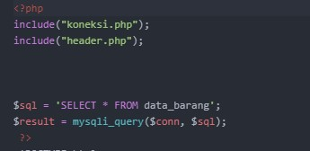
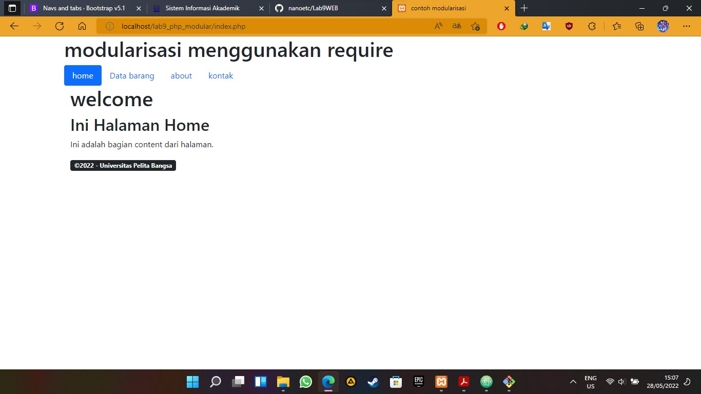
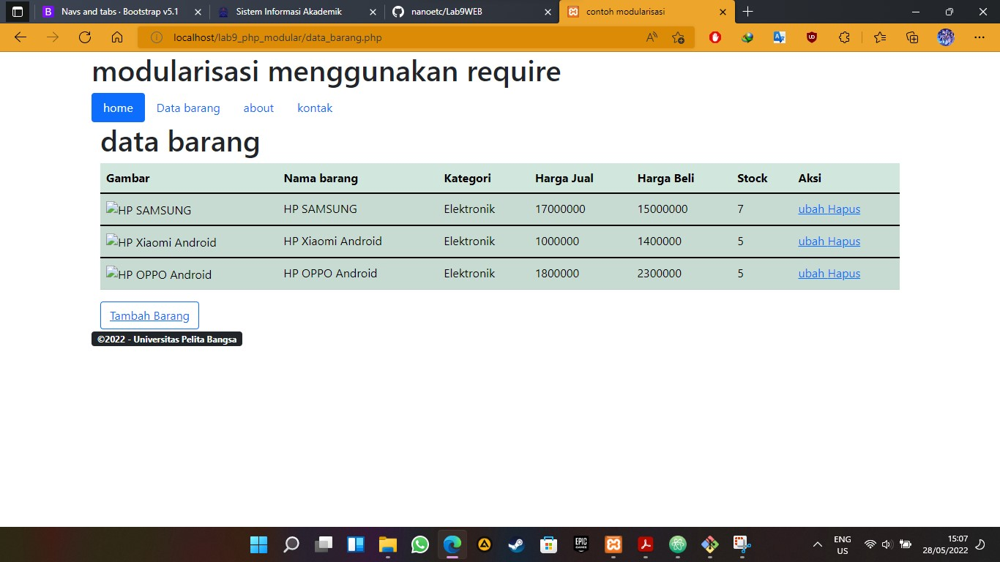
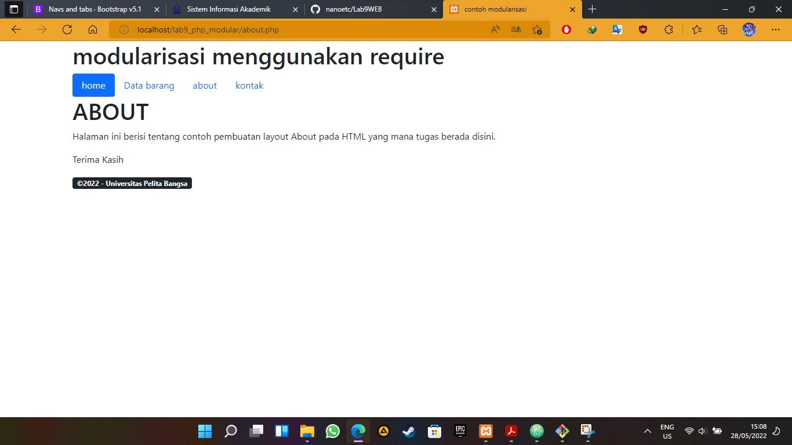
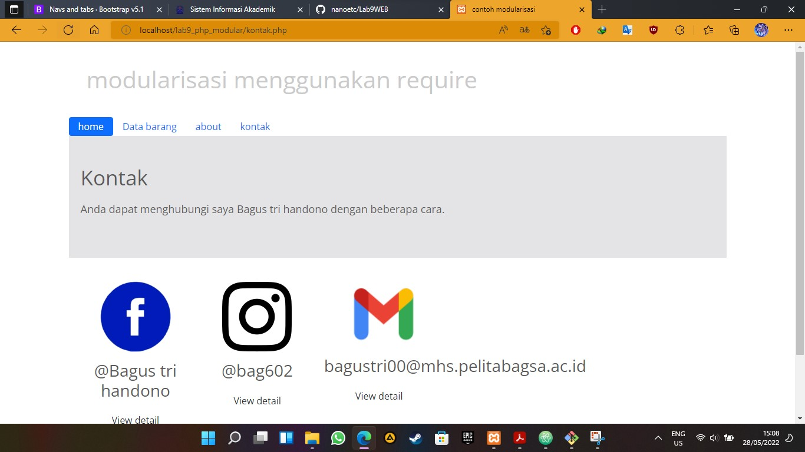

# Lab9WEB
# bagus tri handono - 312010170
# 20.TI.B1
============================================================= 
membuat php modular dari lab8. 
1.buat [header](code/header.php) untuk pertama  
2.lalu buat [footer](code/footer.php) untuk yang kedua  
3.lalu buat [home](code/home.php) untuk tampilan awal 
4.setelah selesai gabungkan pada file [index](code/index.php) 
 
tampilan awal index.php 
 
 
 
 
